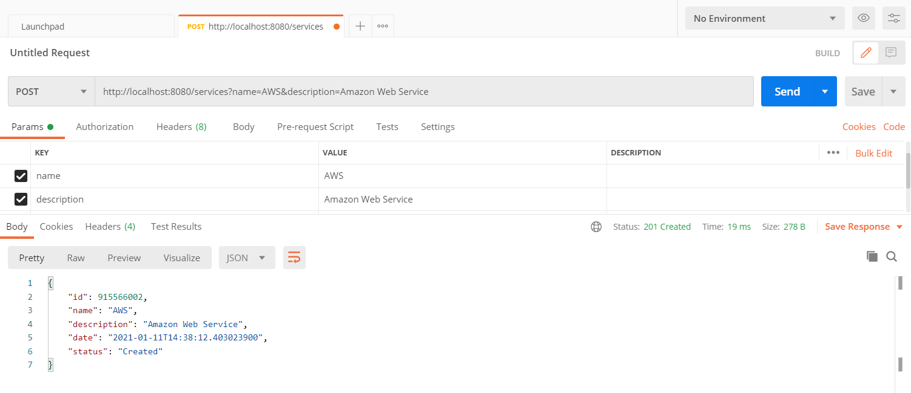
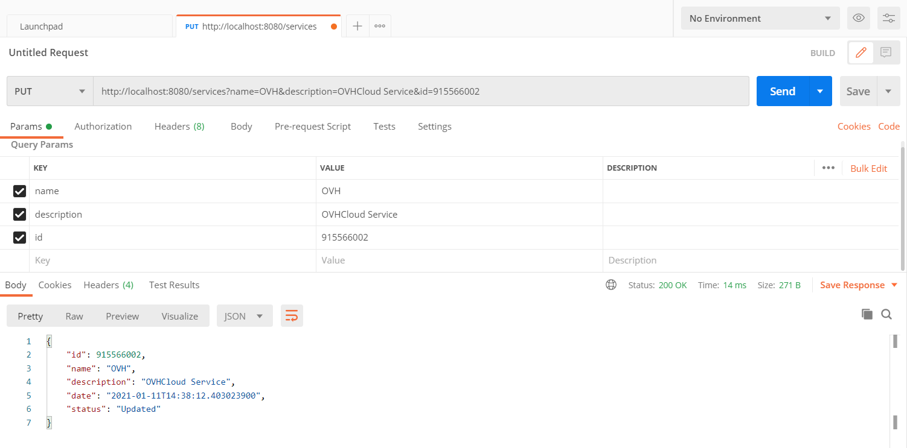
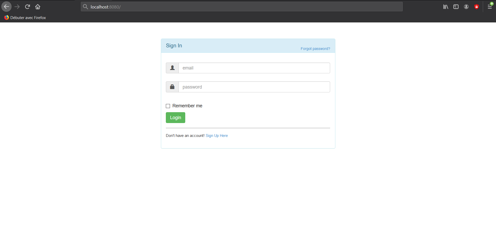
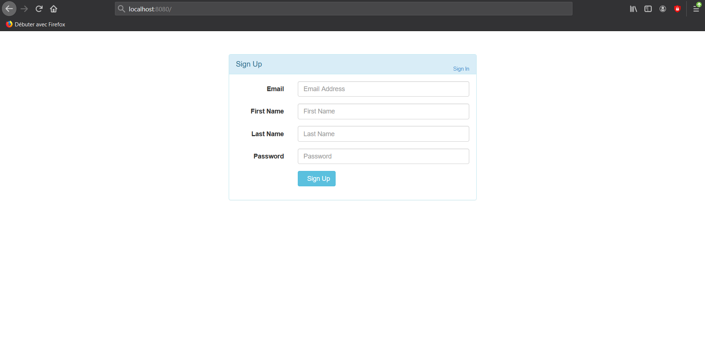

## Welcome to **εφαρμογή**

## Java EE Application for Developers

It's fast and clean, give you freedom to enjoy with Java EE

## Features

*   Servlet which returns a different message depending on the type of request received (GET, POST, PUT, DELETE).
*   Servlet which allows you to simulate a connection to a site (login/password). If the user enters the correct credentials, display the user's name. Otherwise, display an error message.
*   Servlet which allows you to simulate a connection to a site (login/password). If the user enters the correct credentials, redirect him to a new page displaying his name. If not, display a window indicating the connection error.
*   Servlet, which can store a Java object in a cookie or delete it. The graphical interface is composed of a button to create the cookie and a button to delete it. Change the display of the JSP page if the cookie already exists.

## Plateforms

efamorgi is compatible with all plateforms.

## Material Design

*  [`IntelliJ IDEA Community & Ultimate Edition 2020.3.1`](https://www.jetbrains.com/fr-fr/idea/)
*  [`Eclipse IDE For Java Developer 2020-12`](https://www.eclipse.org/)
*  [`Apache NetBeans IDE 12.2`](https://fr.netbeans.org/)
*  [`Payara Plateform Community Edition`](https://www.payara.fish/)


## Requirements

efamorgi is designed too have fairly minimal requirements to build and use with your projects, but there are somes. If you notice any problems on your platform, please notify [`Hethsron Jedaël BOUEYA`](mailto:hetshron-jeadel.boueya@uha.fr) or [`Omar CHICHAOUI`](mailto:omar.chichaoui@uha.fr). Patches and fixing them for welcome !

## Development
For developement, before running the application, you need to clone this project on your local repository, open it with Android Studio and Build Apps as follows :

1. Clone the `efamorgi` repo locally :

    ```console
        $ git clone https://github.com/Hethsron/efamorgi.git
    ```

2. Open this project with Eclipse IDE

3. Run the application server [`Payara`](https://www.payara.fish/) by opening a terminal and executing the following command to start it :

    ```console
        $ asadmin start-domain
    ```

    To verify that you are running the application server, open a browser and go to [`http://localhost:4848`](http://localhost:4848) to display the Payara server console.

    Notice : To stop your application server, open a terminal and execute the following command :

    ```console
        $ asadmin stop-domain
    ```

4. Launch this project locally on your [`Payara Server 5.2020.7`](https://www.payara.fish/downloads/payara-platform-community-edition/)

## Usage

### Command-Line interface
When you use [`Postman Desktop Agent`](https://www.postman.com/) to to send requests and receive responses through our REST API








## Tutorial

If you have Community or Ultimate Edition of IntelliJ and want to create your own servlet, you can follow the tutorial [`by Gaurav Gupta`](https://blog.payara.fish/payara-platform-support-for-intellij-plugin)
